# Swarm-Driven Agent (SDA) Installer & Workflow

A universal, local-first installer and manager for **SDA** (Swarm-Driven Agent) configurations and **SWDD** (Swarm-Driven Development) workflows. It simplifies scanning, version checking, upgrading, and creating Hermes and OpenClaw agents on your local machine.

---

## 🌟 Architecture & Nomenclature

To ensure consistent logic and governance, this project strictly distinguishes between the agent's runtime structure and its development methodology:

| Term | Context | File | Purpose |
| :--- | :--- | :--- | :--- |
| **SDA** | Swarm-Driven Agent | [SOUL.md](SOUL.md) | Streamlined entry point focusing strictly on **System Identity** (定位) and dual-core references. |
| **SDA Contract** | System Contract | [RULE.md](RULE.md) | Defines FSM transition hooks, attention anchors, memory decay, safety firewalls, and self-diagnosis. |
| **SWDD** | Swarm-Driven Development | [SKILL.md](SKILL.md) | The supreme development meta-skill (做事方法) describing parallel planning, Builder/Destroyer reviews, and sandbox execution. |

---

## 🚀 Key Features

* 🔒 **Strictly Local & Offline**: Operates 100% locally on your file system using `os.walk` to find agent profiles under `~/.hermes` and `~/.openclaw`.
* 🔄 **Smart FSM Merging**: Upgrades agent configurations while preserving customized system positioning (`# 1. 系統定位` such as specific Quant profiles), merging only the updated FSM rules and contracts.
* 📊 **Version Tracking & Status check**: Uses semantic version parsing to compare installed files against templates, reporting `Not Installed`, `Update Available`, or `Up-to-date` statuses.
* ➕ **Agent Creation**: Spin up brand new Hermes or OpenClaw agents from scratch with auto-configured workflows using a single command.
* 🛡️ **Auto-Backup System**: Creates timestamped backups (e.g. `SOUL.md.20260624_150000.bak`) automatically before editing any file.

---

## 📂 Repository Layout

```
swarm-driven-agent/
├── installer.py     # CLI installer engine & helper functions
├── setup.py         # Installer packaging for the swda CLI command
├── template/
│   ├── integrated/
│   │   └── ALL_IN_RULE.md         # Single-file bundle (for general LLM tools)
│   └── modular/
│       ├── SOUL.md                # SDA System Identity template (openclaw/hermes)
│       ├── RULE.md                # SDA System Instruction Contract (openclaw/hermes)
│       └── SKILL.md               # SWDD Swarm meta-skill workflow (openclaw/hermes)
├── docs/
│   ├── contracts/
│   │   ├── output-schema.md          # Integrated output schema contract
│   │   └── output-schema-modular.md  # Modular output schema contract
│   ├── papers/
│   │   └── 2605.22166-life-harness.md  # Notes on the Life-Harness paper
│   └── research/
│       └── life-harness-adaptation-plan.md  # SWDD optimization & adaptation plan
├── images/          # Visualizations of the SWDD architecture & FSM
├── test_installer.py # Automated test suite for the installer
└── .gitignore       # Standard git ignore definitions
```

---

## 🎨 Architecture Visualizations

A curated gallery of the SWDD / SDA cognitive architecture, rendered as standalone SVG diagrams (no external assets, fully scalable).

### 1. Swarm Architecture — Dual-Core Topology
The **SOUL** core at the center orchestrating six peripheral subagents (Alpha / Beta / Gamma / Builder / Destroyer / Mempalace). Concentric rotating rings symbolize the FSM state space; glowing dashed lines represent the data-flow contract between the soul and its swarm.



### 2. The Crucible — Adversarial Spec Forge
A **Builder × Destroyer** arena where the specification document is hammered between the two perspectives. The autorubric score `S = Σ wᵢ · cᵢ` gates acceptance, with a hard **3-round circuit breaker** that escalates to HITL on failure.



### 3. Finite State Machine — Hook Transition Flow
The complete **6-hook SOUL FSM** (`INTENT_GATE → DESTRUCT → GATHER → HYPERPLAN → SYNTHESIS → DYNAMIC_COMPILE`) with explicit loopbacks, continuation arc, and the 5 sub-roles spawned during the 7-step swarm execution.



### 4. Mempalace — Knowledge Palace
A 3D cathedral representing the **memory palace**: central dome (mempalace core) surrounded by floating **wing-orbs** (backend, decisions, meetings, anti-patterns, specs, prompts) connected via **tunnels**. Every drawer is a verbatim chunk of knowledge, retrievable via semantic search.



### 5. Ebbinghaus Memory Decay — Retention Curve
The retention function `R(t) = P · F^c · e^(−λ·t)` plotted as a glowing decay curve, with the **GC threshold at R = 0.15** marked as a red dashed line. Beyond this, memory nodes are evicted from the active context and archived to the global read-only store.



---

## 🛠️ CLI Installation & Usage

You can package and install the script locally as a global or developer command-line tool `swda`.

### 1. Installation
Run the following command in the repository root directory:
```bash
pip install -e .
```
*(On macOS, if pip blocks global package modification, use `pip install --break-system-packages -e .`)*

Once installed, the `swda` command is available globally.

### 2. Interactive Selection Menu
Run the installer with no subcommands to scan your system and choose which agents to update interactively:
```bash
swda install
```

### 3. Check Agent Statuses (Doctor)
Run the doctor command to check the SOUL/RULE/SKILL version status of all **explicitly installed** agents (tracked in `~/.swda/installed_agents.json`). Uninstalled or untracked agents are ignored by default to prevent noise:
```bash
swda doctor
```

### 4. Automatically Fix/Upgrade Tracked Agents
Quickly fix or upgrade all outdated, tracked agents to the latest templates:
```bash
swda doctor --fix -y
```

### 5. Create a Brand New Agent
Initialize a new agent workspace folder, set its system identity, install the SDA workflow, and automatically register it in the installed list:
```bash
# Initialize an OpenClaw agent
swda install --create my_coder_agent --type openclaw --identity "A senior software engineering assistant specializing in Python refactoring."

# Initialize a Hermes agent
swda install --create my_analyst_agent --type hermes
```

### 6. Install/Upgrade/Update Specific Agents
Install or update the SDA workflow on specific agents. Note that multiple agents must be separated by commas (no spaces allowed, spaces are reserved for CLI options):
```bash
# Install on xuandao and finance agents (registers them as tracked)
swda install xuandao,finance

# Update templates on xuandao and finance agents
swda update --agents xuandao,finance

# Prompt for interactive selection to update tracked agents
swda update --agents
```

### 7. Self-Upgrade swda CLI Tool
Self-upgrade the CLI tool itself by pulling the latest changes from the git remote repository and re-installing the package:
```bash
swda update
```

### 8. Uninstall SDA Workflow
Cleanly remove the SDA/SWDD files from specified agents, revert `SOUL.md` back to its original System Identity, and remove them from the tracked installed list:
```bash
# Uninstall from specific agents
swda install --uninstall xuandao,finance
# Or:
swda update --uninstall --agents xuandao,finance

# Quietly uninstall from all tracked agents
swda install --uninstall -y all
```

### 9. Run Automated Tests
Execute the comprehensive unit test suite to verify the CLI parser and installer logic:
```bash
python3 test_installer.py
```

---

## 📄 License

This project is licensed under the MIT License.
