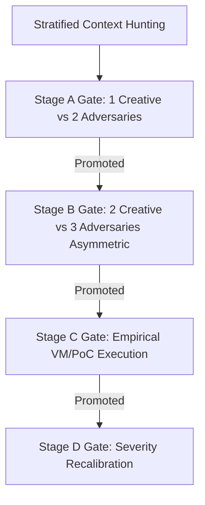

# Swarm-Driven Development (SDD): The Universal Framework

## 1. Overview

**Swarm-Driven Development (SDD)** is a systematic workflow that leverages multiple AI agents (a "swarm") to solve complex engineering problems. It focuses on **specification-first** development, using an adversarial process to "harden" design decisions before any implementation begins.

### Cognitive Execution Engine (SOUL & Skill Synthesis)
Under the agent's **AGI dual-core architecture**, **[SOUL.md]** serves as the Agent's Soul (its cognitive runtime engine and FSM), while **Swarm-Driven Development (SDD)** is the supreme **meta-skill (做事方法)**. SDD coordinates, schedules, and executes all other physical skills and subagents under the logical guidance of SOUL, driving the agent through phases using strict XML boundaries to ensure structured parsing, tool calling, and verification.

### Core Principles
1.  **Spec-First Development**: No code is written until a specification has passed the "Crucible" (adversarial review).
2.  **Asymmetric Dialectic**: Separate agents represent different perspectives (Builder vs. Destroyer) to eliminate cognitive bias (leniency bias).
3.  **Parallel Intelligence**: Concurrent research by specialized nodes (Alpha, Beta, Gamma) to explore the solution space quickly.
4.  **Verification-Centric**: Every step includes automated or multi-agent validation.
5.  **Heterogeneous Model Strategy**: For adversarial review and validation gates, the swarm MUST utilize distinct model families (e.g. Creator: Claude 3.5 Sonnet, Critic: DeepSeek R1). Pitting different providers' architectures against each other uncovers correlated blind spots that same-family evaluations often miss.

### 1.1 Orchestration Mechanics & Strategy
To maximize execution reliability, SDD enforces a strict structure on LLM communication and state control:
*   **Standardized Operating Procedures (SOPs)**: Complex tasks are serialized into explicit prompt sequences and role responsibilities. This prevents cascading hallucinations by ensuring each subagent has a single, well-defined objective and clear inputs/outputs.
*   **Communicative Chain-of-Thought**: Rather than letting agents debate unconstrained, communication is mapped to state transitions. Agents communicate using structured schemas (such as specifications and test logs) to filter out semantic noise.
*   **Decoupled State Control**: The macroscopic FSM flow is managed by `SOUL.md` while physical skills are executed by SDD, preventing progress dissolution within long context windows.

---

## 2. The SDD Lifecycle (6 Phases)

To ensure seamless coordination with the cognitive engine, the 6 conceptual SDD phases strictly map to the SOUL Finite State Machine (FSM) hooks:

| SDD Conceptual Phase | SOUL FSM Hook | Core Responsibility | Operational Rationale |
| :--- | :--- | :--- | :--- |
| **Phase 1: DESTRUCT** | `[PHASE_1_DESTRUCT]` | Parallel, multi-node research | SOP Role Specialization (Alpha/Beta/Gamma) |
| **Phase 2: GATHER** | `[PHASE_2_GATHER]` | Intelligence consolidation | Information Filtering & Deduplication |
| **Phase 3/4: CRUCIBLE** | `[PHASE_3_HYPERPLAN]` | Adversarial review (Builder vs. Destroyer) | Leniency Bias Mitigation (Creator vs. Critic) |
| **Phase 5: SYNTHESIS** | `[PHASE_4_SYNTHESIS]` | Final blueprint and ADR generation | State Consolidation & Intent Lock-in |
| **Phase 6: IMPLEMENT** | `[PHASE_DYNAMIC_COMPILE]` | Physical execution & validation loop | Spec-Driven Dev & Independent Review |

### PHASE 1: DESTRUCT (Parallel Research)
Dispatch three isolated nodes to explore the problem space. Under the SOUL runtime, this maps to **`[PHASE_1_DESTRUCT]`**, producing the structured `<DESTRUCT_RESULT>` output.

*   **Alpha (The Standard)**: Researches "best practices," mainstream frameworks, and the canonical way to solve the problem.
*   **Beta (The Adversary)**: Focuses exclusively on failure modes—edge cases, race conditions, security risks, and technical debt.
*   **Gamma (The Innovator)**: Looks for cross-domain analogies and unconventional "out-of-the-box" alternatives.

*Actionable Directives for DESTRUCT:*
1.  **Strict Isolation**: Alpha, Beta, and Gamma must not share details or view each other's outputs during Phase 1. This prevents early consensus and cognitive alignment.
2.  **Output Formats**: Outputs must be pure technical lists under their respective roles, focusing strictly on facts, code symbols, and direct constraints.

**Prompt Pattern:**
> "Analyze [Task Name]. Focus on: [Alpha: Best Practices | Beta: Breaking Points | Gamma: Novel Approaches]. Output pure technical facts in a bulleted list."

### PHASE 2: GATHER (Intelligence Consolidation)
Consolidate facts from Alpha, Beta, and Gamma. Under the SOUL runtime, this maps to **`[PHASE_2_GATHER]`**, producing the structured `<GATHER_RESULT>` list output.
*   **動態 AST 語意追蹤 (Dynamic AST Semantic Tracing)**: When gathering context for problem-solving or bug-fixing, agents are strictly prohibited from relying solely on regex or plain-text searches. Agents **must** prioritize AST-based semantic navigation (e.g., using `codegraph` to trace callers/callees and structural dependencies) to build mathematically sound context.
*   Extract constraints, dependencies, and risks based on AST evidence.
*   Identify the most promising solution path without synthesizing into architecture yet.

### PHASE 3 & 4: THE CRUCIBLE (Builder vs. Destroyer)
This represents the adversarial debate phase. Under the SOUL runtime, these two phases are executed in a tight adversarial loop under **`[PHASE_3_HYPERPLAN]`**, producing the structured `<HYPERPLAN_RESULT>` output.

1.  **Builder (Architecture Design)**: Uses the gathered intelligence to create a formal Architecture Specification.
    *   **Required Specification Sections:**
        1.  *Data Flow*: Module responsibilities, state transitions, and API contracts.
        2.  *Logic/Pseudocode*: Core algorithm logic and error-handling strategies.
        3.  *Assumptions & Limits*: External dependencies and environment constraints.
2.  **Destroyer (The Crucible)**: Attacks the Builder's specification.
    *   **The "Crucible" Checklist (Destroyer must assume the design is broken):**
        *   *Logic Flaws*: Deadlocks, race conditions, or state inconsistencies.
        *   *Resilience*: Unhandled exceptions and "silent failure" paths.
        *   *Efficiency*: Performance bottlenecks or resource leaks.
        *   *Security*: Injection, data exposure, or privilege issues.

*   **Autorubric Score Gating**: Evaluators must use an analytic rubric model where score aggregation is calculated as a weighted sum of positive and negative criteria to counteract evaluation leniency bias:
    $$S = \sum w_i c_i$$
    Where $w_i$ represents the weight of criterion $c_i$, and negative weights serve as penalties for documented anti-patterns.
*   **Consensus Limits & Compute Governors**: If the Builder and Destroyer are stuck in a loop after **3 rounds**, the compute governor circuit breaker fires. The FSM halts, rolls back the specification to the last stable state, and alerts a human reviewer to resolve the logical contradiction.

### PHASE 5: SYNTHESIS (Final Blueprint)
Consolidate the hardened spec into a final Execution Directive. Under the SOUL runtime, this maps to **`[PHASE_4_SYNTHESIS]`**, producing the structured `<SYSTEM_SPECIFICATION>` output.
*   Write an **ADR (Architecture Decision Record)** explaining *why* this path was chosen (incorporating the Crucible debate logs).
*   Define the step-by-step implementation plan.
*   **測試驅動驗收 (TDD Auto-Remediation Requirements)**: List specific test cases for validation. The spec must explicitly demand that unit/integration tests be generated and verified to fail (Red state) *before* implementing the actual business logic to pass them (Green state).

### PHASE 6: IMPLEMENT & REVIEW (Multi-Agent Swarm Execution)
Under the SOUL runtime, this maps to the **`[PHASE_DYNAMIC_COMPILE]`** phase, which orchestrates the physical code implementation, validation, and review loop using multiple specialized agents.

1.  **Step 1: Multi-Source Info-Gathering & Intent Analysis**
    *   Dispatch multiple information-gathering subagents to consolidate intelligence and analyze intent.
2.  **Step 2: Tri-Dimensional Thinking Framework**
    *   Establish a cognitive structure with at least three dimensional quadrants to analyze, discuss, and debate the design from diverse perspectives.
3.  **Step 3: DAG-Based Task Orchestration**
    *   For complex, cross-module tasks, the system must automatically construct a **Directed Acyclic Graph (DAG)** of dependencies (e.g., `Schema/DB` $\rightarrow$ `Backend API` $\rightarrow$ `Frontend UI`). 
    *   Subagents are dispatched asynchronously to work on independent nodes of the DAG, automatically triggering downstream nodes upon completion, replacing simple linear staging.
4.  **Step 4: Spec-Driven TDD Implementation (claude)**
    *   Dispatch the `claude` agent to execute physical code development within an **Ephemeral Sandbox**. It must first write tests that fail, then implement the logic to pass them.
5.  **Step 5: Code Quality & Logical Review (claude)**
    *   Dispatch the `claude` agent to perform rigorous code quality audits and logical validation.
6.  **Step 6: Closed-Loop Remediation**
    *   If any validation check fails, direct the `claude` agent to implement fixes.
7.  **Step 7: Task Summary Reporting**
    *   Generate a comprehensive final report summarizing execution details and validation outcomes.

---

## 3. Refute-or-Promote: Adversarial Stage-Gated Defect Discovery

For code security audits, regression analysis, and deep-dive defect discovery, the swarm bypasses standard cooperative structures (which suffer from high false-positive rates due to agreeableness biases) and implements the **Refute-or-Promote** methodology.

### 3.1 Stratified Context Hunting (SCH)
Prior to entering the review gates, candidates are generated by parallel hunters partitioned across three distinct axes:
1.  **Source Stratification**: Hunters are seeded with non-overlapping input sources (e.g., CVE databases, past commits, specification rules, or bug checklists).
2.  **Scope Stratification**: Hunters are confined to non-overlapping directories or architectural components (e.g., memory management, parsers, or network handlers).
3.  **Wave Stratification**: Analysis runs in iterative waves. Subsequent waves are re-seeded with the explicit rationale behind previous promotions and rejections to refine the search.

### 3.2 The Four Stage Gates
Vulnerability candidates must survive all four adversarial validation gates to be accepted:
*   **Stage A Gate (Initial Sifting)**: Dispatches 1 creative agent to write a vulnerability reachability argument and 2 independent adversarial agents to disprove it. The adversaries receive only the vulnerability description (not the reasoning) to avoid confirmation bias. If either adversary successfully refutes it, the report is rejected.
*   **Stage B Gate (Asymmetric Consensus)**: Evaluates the bug with 2 creative and 3 adversarial agents (incorporating a senior-tier model). Agents operate with asymmetric context (some read complete summaries, others execute a cold-start review) to ensure unanchored validation of the reachability path.
*   **Stage C Gate (Empirical Validation)**: To eliminate hallucinations, the runtime provisions an isolated virtual sandbox, compiles the target repository, and runs Proof-of-Concept (PoC) scripts. Any candidate defect that fails to execute or reproduce in the sandbox is immediately blocked.
*   **Stage D Gate (Severity Recalibration)**: Confirmed bugs undergo automated severity checks. Adversaries try to argue CVSS metrics downwards to match actual sandbox constraints before human disclosure.

---

## 4. Context Optimization (Arachne Context Engine)

To prevent the "lost-in-the-middle" retrieval problem and conserve tokens, code retrieval MUST pass through the **Arachne context optimizer** ($N_2$-arachne):
*   **Compression Rate**: arachne uses C++ SIMD extensions to compress context requirements by up to **98.5%** by parsing codebase dependencies in real-time.
*   **Ordering Rule**: arachne orders retrieved context blocks using an $f(x) \propto 1/x$ distribution layout. High-relevance targets are placed at the very beginning and very end of the prompt window, where LLM recall is mathematically strongest.

---

## 5. When to Use SDD

Under the SOUL cognitive runtime, Swarm-Driven Development (SDD) is the **compulsory and default path** for any coding, implementation, or configuration task. Single-agent execution is reserved strictly for non-functional document updates.

*Implementation Note: When a task is parsed by SOUL's **`[INTENT_GATE]`** hook, the flag **`USE_SWARM_WORKFLOW: True`** must be explicitly set for all engineering and codebase tasks.*

| Project Type | Use SDD? | Rationale |
| :--- | :---: | :--- |
| **Pure Documentation Edits** | No (Optional) | Typos in Markdown or comment formatting that do not change code logic. |
| **Simple Bug Fix (even 1-line)** | **Yes (Required)** | Prevents regression, verifies side-effects, and ensures code contract validation. |
| **Complex Bug Fix** | **Yes (Required)** | Traces root causes and ensures Crucible vulnerability check. |
| **New Module/Feature** | **Yes (Required)** | Prevents architectural drift and ensures TDD validation. |
| **Refactoring Legacy Code** | **Yes (Required)** | Maps hidden dependencies and AST boundaries. |
| **Security-Critical Path** | **Yes (Required)** | Essential for Refute-or-Promote audit gates and sandbox verification. |
| **Exploratory Research** | **Yes (Required)** | Uses isolated multi-node research (Alpha/Beta/Gamma). |

---

## 6. Tooling & Automation

### Clawteam Integration (Complex Swarms)
For high-complexity tasks, use `clawteam` to manage persistent agents:
*   `clawteam launch research-paper`: For Phase 1 deep research.
*   `clawteam launch code-review`: For Phase 4/6 adversarial reviews.

### Agentic CI/CD Background Integration
*   The Refute-or-Promote adversarial framework should be deployed as a background listener (e.g., integrated into Git Hooks or GitHub Actions). 
*   When a developer issues a Pull Request, the "Red Team Agent" automatically awakens to perform security scans and logical cross-examination, transforming SDD from a "development method" into a "Continuous Agentic Immune System".

### SPEC-Driven Workflow (Standard Templates)
Always maintain a `docs/specs/` folder. A spec is only "Complete" if it includes:
*   **Problem Statement**
*   **Interface Contract** (Input/Output/Side-effects)
*   **Acceptance Criteria** (Gherkin/BDD format preferred)
*   **Risk Assessment**

---

## 7. Universal Best Practices

1.  **Source-First Analysis**: Never trust documentation or `.env` files alone. Always read the source code (the "Truth") before starting Phase 1.
2.  **Bounded Context**: Ensure each subagent has enough context to understand the *intent*, but not so much that it gets distracted by unrelated files. Use Arachne to automate this filtering.
3.  **Empirical Validation**: If a design involves mathematical models or performance targets, run a "Pilot Experiment" (Phase 3.5) or VM sandbox PoC before full implementation.
4.  **Consensus Limits**: Apply compute governors to prevent infinite loops. If consensus is not reached after 3 turns, halt and escalate.
5.  **Git Hygiene**: Ensure the implementation agent commits in logical chunks that correspond to the Synthesis plan.
