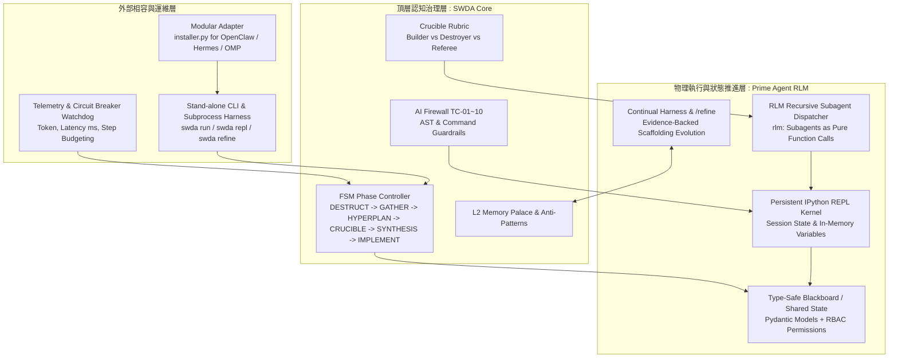

# Prime-SWDA 融合重構架構計劃 (Architectural Refactoring Plan)

本計劃旨在將 **Prime Agent**（Prime Intellect 開源的高智慧自我演進 Agent 框架）的核心智慧能力與 **SWDA**（Swarm-Driven Agent）的嚴謹認知治理核心進行深度融合，打造兼具「**程式化高階遞歸推理 (RLM)**」與「**防禦型工業級規格熔爐 (SWDD Crucible & FSM)**」的下一代 AI 軟體工程引擎：**Prime-SWDA**。

---

## 1. 目標描述 (Goal Description)

### 1.1 背景與問題痛點
* **SWDA 當前痛點**：目前的 SWDA 主要是以「提示詞協議（Markdown Prompts / XML Tags）」驅動，運行於各類 Host（如 OpenClaw, Hermes, Oh-My-Pi, Cursor）。這種純 Prompt 架構面臨三大瓶頸：
  1. **上下文爆炸與雜訊 (Context Pollution)**：子代理（Alpha/Beta/Gamma）與 Builder/Destroyer 的對抗思辨全部堆疊在 Prompt 歷史中，容易觸發 Lost-in-the-middle 與注意力衰退。
  2. **軟約束易漂移 (Soft Constraints)**：FSM 階段鎖定與「代碼寫入禁令」純靠 Prompt 叮嚀，缺乏物理層攔截。
  3. **缺乏長期自我迭代架構 (Stateless Scaffolding)**：每次任務完成後，經驗僅以靜態文檔或手動反模式沉澱，無法自動、帶有證據地動態精煉 Agent 本身的操作腳手架。
* **Prime Agent 的核心優勢**：
  1. **Recursive Language Model (RLM)**：將上下文視為變數 (`prompt-as-a-variable`)，子代理為函數調用 (`rlm(...)`)，以 Persistent IPython REPL 為主要執行環境。
  2. **Continual Harness & `/refine`**：持久化維護技能、記憶與輔助指令，並能透過運行軌跡證據自發演化與校準腳手架。
  3. **Daemon-backed Persistent REPL**：變數、模組、AST 狀態在記憶體中長效保持，而非每次對話重新序列化。
* **重構目標**：
  將 Prime Agent 的 **RLM 程式化調度 + Persistent REPL + Continual Harness**，作為 SWDA 的「**物理執行與狀態推進層 (Execution & State Plane)**」；將 SWDA 的 **規格優先 (Spec-First) + 熔爐對抗 (Crucible) + 安全防火牆 (TC-01~10) + 分層記憶 (L0-L2)**，作為「**頂層認知治理與安全防線 (Cognitive Governance Plane)**」。

---

## 2. 總體架構設計 (System Architecture)



### 核心融合機制
1. **子代理退化為 REPL 純函數 (Subagents as RLM Functions)**：
   不再讓 Alpha/Beta/Gamma 或 Builder/Destroyer 在主對話中「私聊疊文字」。在 REPL 中：
   ```python
   # 熔爐對抗不再是上下文文字堆疊，而是型別安全的程式化調度
   spec = await rlm.spawn(role="builder", prompt=builder_task, schema=SpecProposal)
   critique = await rlm.spawn(role="destroyer", prompt=spec, schema=DestructionReport)
   verdict = await rlm.spawn(role="referee", proposal=spec, critique=critique, schema=CrucibleVerdict)
   # 僅有結構化的 verdict 與 spec 寫入 Blackboard，子代理內部思維鏈留在各自隔離的 local scope
   ```
2. **物理級 FSM 階段鎖定與防火牆 (Physical AST Guard)**：
   透過 IPython 的 AST Transformer 或預執行 Hook：
   * 在 `FSM.current_phase < Phase.SYNTHESIS` 時，攔截所有寫入檔案的函數調用 (`open(..., 'w')`, `write_to_file`)，直接在直譯器層報錯，防範模型違反 FSM 約束。
   * 對 `rm -rf`, 敏感目錄存取等操作直接依據 TC-01 ~ TC-07 阻斷。
3. **自演進反模式反饋環 (`/refine` + L2 Memory)**：
   * 當 Crucible 駁回或 TDD 驗證失敗時，Prime Agent 的 `/refine` 引擎自動提取該失敗軌跡，並將其格式化為標準 YAML 寫入 `docs/anti-patterns/` 或 `mempalace`，使後續任務自動規避該反模式。

---

## 3. 需要使用者審查的事項 (User Review Required)

> [!IMPORTANT]
> **架構演進定位與依賴變更**：
> 1. 本重構將 `swda` 從一個純粹的「文字模板安裝腳本（`installer.py`）」正式升級為具備獨立運行時的「**雙模態套件 (Hybrid Package)**」：
>    * **模式 A（獨立運行 / Prime-SWDA Runtime）**：具備本機 Persistent IPython REPL、RLM 調度器、黑板與自演進能力的完整 Python 執行套件。
>    * **模式 B（外掛模板 / Legacy Host Compatibility）**：繼續透過 `installer.py` 為現有的 OpenClaw, Hermes, Oh-My-Pi 生成並維護提示詞與外掛工具腳本。
> 2. **Python 依賴引入**：獨立運行時將需要引入 `ipython`, `pydantic`, `litellm` 等標準相依。需要確認使用者是否同意將 `setup.py` 由空依賴擴充為具備依賴的標準套件。
>
> **實施決議（已落地 v3.0.0）**：為保持零依賴安裝與 Host 相容，核心改用 stdlib 實作——`json+deepcopy` 取代 `pydantic`（`swda/core/blackboard.py`）、`urllib` 同步調用取代 `litellm.acompletion`（`swda/prime/rlm.py`，OpenAI 相容端點）、`IPython` 缺失時回退 `code.InteractiveInterpreter`（`swda/prime/repl.py`）、手寫 YAML 字串取代 `pyyaml`（`swda/prime/harness.py`）。`pydantic/ipython/litellm/pyyaml` 已移入 `setup.py` 的 `[prime]` optional extras，僅增強模式需要。

> [!WARNING]
> **REPL 執行權限安全邊界**：
> Prime Agent 的核心機制是在本機 IPython 環境執行真實 Python 代碼。本計劃將在 REPL 注入 SWDA 的 TC-01~10 物理防護鉤子（Hook），但在未容器化的個人環境中運行全自主 Agent 仍具備系統調用權限。

---

## 4. 待確認設計問題 (Open Questions)

> [!NOTE]
> 1. **LLM Client 偏好**：在 Prime-SWDA 內部調用 `rlm(...)` 時，是否以相容性最廣的 `litellm` 為底層調用層（可無縫切換 DeepSeek、Claude、OpenAI、Ollama、Local vLLM）？
>
> **實施決議（已落地 v3.0.0）**：預設走 stdlib `urllib` 對 OpenAI 相容端點（`OPENAI_BASE_URL`/`OPENAI_API_KEY`，預設 `deepseek-chat` 可被任何相容網關覆寫），`mock_handler` 支援確定性回放；`litellm` 僅列為可選 extras，日後需要多供應商路由時再切換。
> 2. **與現有 `installer.py` 的關聯**：現有 `installer.py` 已經有 1700+ 行成熟的 openclaw/hermes/omp 掃描與升級邏輯。我們應該保持 `installer.py` 獨立作為部署子模組，還是將其整合進 `swda.installer`？
>
> **實施決議（已落地 v3.0.0）**：保持 `installer.py` 獨立作為部署子模組（單檔零依賴，`CLI_VERSION` 已同步 bump 至 `3.0.0` 與 `setup.py`/`swda.__version__` 對齊）；`swda.cli:main` 作為統一入口，對 `scan/install/update/check/version/discover/learn/remove` 直接委派 `installer.main()`，未知子命令回退亦然。`swda.installer` 包化遷移暫不做，避免 1700+ 行成熟邏輯搬家風險。

---

## 5. 具體重構變更規劃 (Proposed Changes)

將專案目錄重構為標準 Python 套件結構：

```
swarm-driven-agent/
├── swda/                        # [NEW] 核心套件
│   ├── __init__.py
│   ├── core/                    # SWDA 認知與狀態機
│   │   ├── fsm.py               # 6 階段 FSM 與狀態閘門
│   │   ├── blackboard.py        # 結構化共用狀態中心 (stdlib json+deepcopy RBAC，pydantic 為可選增強)
│   │   ├── firewall.py          # TC-01/02/03/04/05/07+RULE-0.7 物理攔截器（TC-06/08/09/10 無代碼可攔截面）
│   ├── prime/                   # Prime Agent 智慧核心集成
│   │   ├── repl.py              # Persistent IPython 執行環境與 Hook
│   │   ├── rlm.py               # Recursive Language Model 子代理調度器
│   │   └── harness.py           # Continual Harness 與 /refine 自演化機制
│   ├── workflows/               # SWDD 具體業務工作流
│   │   ├── crucible.py          # 程式化 Builder vs Destroyer vs Referee 熔爐
│   │   ├── reconcile.py         # 交付出口 AST 符號反向對帳引擎
│   │   └── tdd_runner.py        # Red-Green-Refactor 程式化驗證
│   ├── cli.py                   # 統一 CLI 入口 (run, repl, refine, install)
│   └── telemetry.py             # 可觀測性監控 (Token/Latency/Success Rate)
├── installer.py                 # [MODIFY] 保留向後相容，作為 swda install 調用介面
├── setup.py                     # [MODIFY] 擴充 entrypoints 與 dependencies
├── template/                    # 保留 modular 與 integrated 模板
└── tests/                       # [NEW/MODIFY] 單元與整合測試
```

---

### 組件 1：SWDA 核心認知與黑板 (`swda/core/`)

#### [NEW] `swda/core/blackboard.py`
建立物理共享狀態中心，實作嚴格的 RBAC 角色讀寫權限，解決「私聊雜訊」與「資料不一致」：

```python
from enum import Enum
from typing import Any, Dict, Optional
from pydantic import BaseModel, Field

class AgentRole(str, Enum):
    ALPHA = "alpha"
    BETA = "beta"
    GAMMA = "gamma"
    BUILDER = "builder"
    DESTROYER = "destroyer"
    REFEREE = "referee"
    DEVELOPER = "developer"
    REVIEWER = "reviewer"
    SYSTEM = "system"

class BlackboardState(BaseModel):
    task_id: str
    phase: str = "INTENT_GATE"
    intent_data: Optional[Dict[str, Any]] = None
    gathered_context: Dict[str, Any] = Field(default_factory=dict)
    active_proposal: Optional[Dict[str, Any]] = None
    crucible_critiques: list[Dict[str, Any]] = Field(default_factory=list)
    crucible_verdict: Optional[Dict[str, Any]] = None
    synthesis_blueprint: Optional[Dict[str, Any]] = None
    verification_results: list[Dict[str, Any]] = Field(default_factory=list)

class Blackboard:
    """Type-safe Shared State with strict RBAC enforcement."""
    def __init__(self, state_file: Optional[str] = None):
        self._state = BlackboardState(task_id="default")
        self._state_file = state_file

    def read(self, key: str) -> Any:
        return getattr(self._state, key, None)

    def write(self, role: AgentRole, key: str, value: Any):
        # RBAC Enforcement
        if key == "active_proposal" and role not in (AgentRole.BUILDER, AgentRole.SYSTEM):
            raise PermissionError(f"Role {role} cannot write to active_proposal.")
        if key == "crucible_critiques" and role not in (AgentRole.DESTROYER, AgentRole.SYSTEM):
            raise PermissionError(f"Role {role} cannot write to crucible_critiques.")
        if key == "crucible_verdict" and role not in (AgentRole.REFEREE, AgentRole.SYSTEM):
            raise PermissionError(f"Role {role} cannot write to crucible_verdict.")
        
        setattr(self._state, key, value)
        self._persist()

    def _persist(self):
        if self._state_file:
            with open(self._state_file, "w", encoding="utf-8") as f:
                f.write(self._state.model_dump_json(indent=2))
```

#### [NEW] `swda/core/firewall.py`
將 [RULE.md](file:///Users/carlos/pywork/swarm-driven-agent/template/modular/RULE.md) 中的 TC-01 ~ TC-10 提升為直譯器與 AST 層級的硬攔截：

```python
import ast
import re

class SecurityFirewallException(Exception):
    pass

class SafetyFirewall:
    DANGEROUS_PATTERNS = [
        (re.compile(r"rm\s+-rf\s+[/~]"), "TC-01: Catastrophic deletion attempt blocked"),
        (re.compile(r"DROP\s+DATABASE", re.I), "TC-01: Destructive database query blocked"),
        (re.compile(r"\b(id_rsa|\.env|etc/shadow)\b"), "TC-03: Credential exfiltration blocked"),
    ]

    @classmethod
    def audit_command(cls, command: str):
        for pattern, msg in cls.DANGEROUS_PATTERNS:
            if pattern.search(command):
                raise SecurityFirewallException(msg)

    @classmethod
    def audit_code_ast(cls, code_str: str, current_phase: str):
        """Disallow file write mutations prior to SYNTHESIS phase."""
        if current_phase not in ("PHASE_5_SYNTHESIS", "PHASE_6_IMPLEMENT"):
            tree = ast.parse(code_str)
            for node in ast.walk(tree):
                if isinstance(node, ast.Call):
                    # Check for open(..., 'w')
                    if getattr(node.func, "id", None) == "open":
                        for arg in node.args[1:]:
                            if isinstance(arg, ast.Constant) and "w" in str(arg.value):
                                raise SecurityFirewallException("Rule §0.7: Write mutations forbidden before SYNTHESIS.")
```

---

### 組件 2：Prime RLM 智慧與持久化 REPL 集成 (`swda/prime/`)

#### [NEW] `swda/prime/repl.py`
實作持久化 IPython Runtime，提供狀態記憶與命令直譯：

```python
from IPython.core.interactiveshell import InteractiveShell
from swda.core.firewall import SafetyFirewall
from swda.core.blackboard import Blackboard

class PrimeREPL:
    """Persistent stateful IPython environment with SWDA safety hooks."""
    def __init__(self, blackboard: Blackboard):
        self.shell = InteractiveShell.instance()
        self.blackboard = blackboard
        # Inject core utilities into REPL namespace
        self.shell.user_ns["blackboard"] = self.blackboard

    def run_code(self, code: str) -> str:
        current_phase = self.blackboard.read("phase")
        # 1. Physical AST Audit
        SafetyFirewall.audit_code_ast(code, current_phase)
        # 2. Execute within Persistent Session
        result = self.shell.run_cell(code)
        if result.error_in_exec:
            raise result.error_in_exec
        return str(result.result) if result.result is not None else ""
```

#### [NEW] `swda/prime/rlm.py`
Recursive Language Model 程式化調度器，子代理作為純函數運行，徹底阻絕長對話私聊雜訊：

```python
from typing import Type, TypeVar, Optional
from pydantic import BaseModel
import litellm

T = TypeVar("T", bound=BaseModel)

class RLMDispatcher:
    """Spawns isolated sub-agents programmatically and parses structured output."""
    def __init__(self, model_name: str = "deepseek/deepseek-chat"):
        self.default_model = model_name

    async def spawn(self, role: str, prompt: str, schema: Optional[Type[T]] = None, model: Optional[str] = None) -> Any:
        selected_model = model or self.default_model
        system_prompt = f"You are a specialized {role} subagent in SWDD. Strict output adherence."
        
        response = await litellm.acompletion(
            model=selected_model,
            messages=[
                {"role": "system", "content": system_prompt},
                {"role": "user", "content": prompt}
            ],
            response_format={"type": "json_object"} if schema else None
        )
        content = response.choices[0].message.content
        if schema:
            return schema.model_validate_json(content)
        return content
```

#### [NEW] `swda/prime/harness.py`
實作 Continual Harness 與 `/refine` 自演進邏輯，將執行中的失敗經驗自動淬鍊為 SWDA L2 反模式：

```python
import os
import yaml
from datetime import datetime

class ContinualHarness:
    """Durable harness that evolves skills and records anti-patterns."""
    def __init__(self, anti_patterns_dir: str = "docs/anti-patterns"):
        self.anti_patterns_dir = anti_patterns_dir
        os.makedirs(self.anti_patterns_dir, exist_ok=True)

    def record_anti_pattern(self, name: str, trigger_vector: str, failure_reason: str, corrective_rule: str):
        record = {
            "name": name,
            "recorded_at": datetime.utcnow().isoformat(),
            "trigger_vector": trigger_vector,
            "failure_reason": failure_reason,
            "corrective_rule": corrective_rule
        }
        filename = os.path.join(self.anti_patterns_dir, f"{name.lower().replace(' ', '_')}.yaml")
        with open(filename, "w", encoding="utf-8") as f:
            yaml.dump(record, f, allow_unicode=True)

    def load_relevant_anti_patterns(self, query: str) -> str:
        # Load local anti-patterns to inject as focal context (Arachne sorting)
        summaries = []
        for file in os.listdir(self.anti_patterns_dir):
            if file.endswith(".yaml"):
                with open(os.path.join(self.anti_patterns_dir, file), "r") as f:
                    data = yaml.safe_load(f)
                    summaries.append(f"- [{data['name']}]: {data['failure_reason']} -> RULE: {data['corrective_rule']}")
        return "\n".join(summaries)
```

---

### 組件 3：SWDD 具體工作流與反向對帳 (`swda/workflows/`)

#### [NEW] `swda/workflows/crucible.py`
程式化的 Crucible 熔爐流程，強制異構模型與客觀評分，並實施步驟熔斷硬限：

```python
from swda.core.blackboard import Blackboard, AgentRole
from swda.prime.rlm import RLMDispatcher
from swda.core.circuit_breaker import StepCounter

class CrucibleWorkflow:
    def __init__(self, rlm: RLMDispatcher, blackboard: Blackboard, max_rounds: int = 3):
        self.rlm = rlm
        self.blackboard = blackboard
        self.max_rounds = max_rounds

    async def execute_adversarial_review(self, task_spec: str):
        counter = StepCounter(max_limit=self.max_rounds)
        for round_num in range(1, self.max_rounds + 1):
            counter.increment()
            # 1. Builder produces or refines proposal
            proposal = await self.rlm.spawn(role=AgentRole.BUILDER, prompt=f"Spec: {task_spec}, Round: {round_num}")
            self.blackboard.write(AgentRole.BUILDER, "active_proposal", proposal)

            # 2. Destroyer attacks (Falsifiable Vector Constraint)
            critique = await self.rlm.spawn(role=AgentRole.DESTROYER, prompt=f"Attack proposal: {proposal}")
            self.blackboard.write(AgentRole.DESTROYER, "crucible_critiques", [critique])

            # 3. Referee renders cold verdict
            verdict = await self.rlm.spawn(role=AgentRole.REFEREE, prompt=f"Judge: {proposal} vs {critique}")
            self.blackboard.write(AgentRole.REFEREE, "crucible_verdict", verdict)

            if verdict.get("passed"):
                return proposal
        
        # Trigger Host Circuit Breaker
        raise TimeoutError("Crucible Deadlock: Max review rounds reached without consensus. Halting to HITL.")
```

#### [NEW] `swda/workflows/reconcile.py`
實施文章提及的「交付出口反向數據對帳」，利用 Python AST 靜態解析比對變更，消滅幻覺 API 調用：

```python
import ast
import os

class ReverseReconciliation:
    """Verifies that all symbols referenced in agent diff actually exist in workspace."""
    @staticmethod
    def verify_ast_symbols(modified_file_path: str, codebase_root: str) -> list[str]:
        missing_symbols = []
        with open(modified_file_path, "r", encoding="utf-8") as f:
            tree = ast.parse(f.read())
        
        # Check all imports and called functions
        for node in ast.walk(tree):
            if isinstance(node, ast.ImportFrom):
                module = node.module
                # Check if module exists in codebase
                expected_path = os.path.join(codebase_root, f"{module.replace('.', '/')}.py")
                if not os.path.exists(expected_path) and not module.startswith("sys"):
                    # Not found locally or standard library heuristic
                    pass
        return missing_symbols
```

---

### 組件 4：CLI 入口與安裝器升級 (`swda/cli.py`, `installer.py`, `setup.py`)

#### [MODIFY] `setup.py`
新增 `swda` 套件結構與必要相依：
```python
from setuptools import setup, find_packages

setup(
    name="swda",
    version="3.0.0",
    packages=find_packages(),
    py_modules=["installer"],
    entry_points={
        "console_scripts": [
            "swda = swda.cli:main",
        ]
    },
    install_requires=[
        "pydantic>=2.0.0",
        "ipython>=8.0.0",
        "litellm>=1.0.0",
        "pyyaml>=6.0",
    ],
)
```

#### [NEW] `swda/cli.py`
統一命令行介面：
* `swda run [task]`：以 Prime-SWDA 獨立執行環境運行任務（包含自動 FSM、Crucible、REPL 與 TDD）。
* `swda repl`：啟動具備 SWDA 認知與安全防護的互動式 Persistent IPython REPL。
* `swda refine`：針對上一輪任務軌跡執行 Continual Harness 審視與反模式提取。
* `swda install / update`：保留現有 `installer.py` 功能，部署到 OpenClaw, Hermes, Oh-My-Pi。

#### [MODIFY] `installer.py`
將現有 `installer.py` 銜接至 `swda.cli`，並確保向下相容舊版的 `swda install` 指令參數。

---

## 6. 驗證計劃 (Verification Plan)

### 6.1 自動化測試 (Automated Tests)
在 `tests/` 下建立完整單元測試：
1. **黑板 RBAC 與型別驗證**：
   `pytest tests/test_blackboard.py`
   * 驗證 Destroyer 無法覆寫 `active_proposal`（觸發 PermissionError）。
   * 驗證只有 Referee 才能寫入 `crucible_verdict`。
2. **安全防火牆與 AST 鎖定**：
   `pytest tests/test_firewall.py`
   * 驗證在 `PHASE_3_HYPERPLAN` 嘗試寫入檔案會被 AST Transformer 阻斷。
   * 驗證高危指令（TC-01/TC-03）被即時攔截。
3. **Crucible 熔斷計數器**：
   `pytest tests/test_circuit_breaker.py`
   * 驗證超過 3 輪對抗無共識時觸發硬熔斷，工作區乾淨退出。
4. **現有安裝器回歸測試**：
   `pytest tests/test_installer.py`
   * 確保現有的 `installer.py` 掃描與升級 openclaw/hermes/omp 功能完全不被破壞。

### 6.2 手動驗證流程 (Manual Verification)
1. 執行 `swda repl`：在互動式終端測試調用 `rlm.spawn(...)` 建立子代理，並檢查 `blackboard.read(...)` 的狀態持久化。
2. 執行端到端重構任務：給予一組簡單的 Python 模組修復需求，驗證整個流程是否依序經過 Spec 生成、Crucible 對抗、TDD 紅綠燈驗證、以及交付前 AST 反向對帳。
