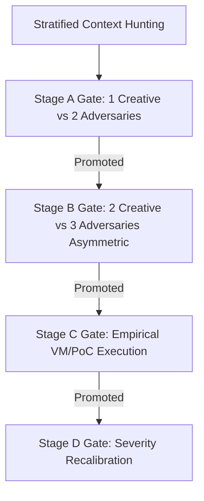

# Swarm-Driven Development (SWDD): The Universal Framework

## 1. Overview

**Swarm-Driven Development (SWDD)** is a systematic workflow that leverages multiple AI agents (a "swarm") to solve complex engineering problems. It focuses on **specification-first** development, using an adversarial process to "harden" design decisions before any implementation begins.

### Cognitive Execution Engine (SOUL & Skill Synthesis)
Under the agent's **AGI dual-core architecture**, **[SOUL.md](../../SOUL.md)** serves as the Agent's Soul (its cognitive runtime engine and FSM, managed under the operational contract **[RULE.md](../../RULE.md)**), while **Swarm-Driven Development (SWDD)** is the supreme **meta-skill (methodology)**. SWDD coordinates, schedules, and executes all other physical skills and subagents under the logical guidance of SOUL, driving the agent through phases using strict XML boundaries to ensure structured parsing, tool calling, and verification.

### Core Principles
1.  **Spec-First Development**: No code is written until a specification has passed the "Crucible" (adversarial review).
2.  **Asymmetric Dialectic**: Separate agents represent different perspectives (Builder vs. Destroyer) to eliminate cognitive bias (leniency bias).
3.  **Parallel Intelligence**: Concurrent research by specialized nodes (Alpha, Beta, Gamma) to explore the solution space quickly.
4.  **Verification-Centric**: Every step includes automated or multi-agent validation.
5.  **Heterogeneous Model Strategy**: For adversarial review and validation gates, the swarm MUST utilize distinct model families (e.g. Creator: Claude 3.5 Sonnet, Critic: DeepSeek R1). Pitting different providers' architectures against each other uncovers correlated blind spots that same-family evaluations often miss.

### 1.1 Orchestration Mechanics & Strategy
To maximize execution reliability, SWDD enforces a strict structure on LLM communication and state control:
*   **Standardized Operating Procedures (SOPs)**: Complex tasks are serialized into explicit prompt sequences and role responsibilities. This prevents cascading hallucinations by ensuring each subagent has a single, well-defined objective and clear inputs/outputs.
*   **Communicative Chain-of-Thought**: Rather than letting agents debate unconstrained, communication is mapped to state transitions. Agents communicate using structured schemas (such as specifications and test logs) to filter out semantic noise.
*   **Decoupled State Control**: The macroscopic FSM flow is managed by [SOUL.md](../../SOUL.md) while physical skills are executed by SWDD, preventing progress dissolution within long context windows.

---

## 2. The SWDD Lifecycle (6 Phases)

To ensure seamless coordination with the cognitive engine, the 6 conceptual SWDD phases strictly map to the SOUL Finite State Machine (FSM) hooks defined in [RULE.md](../../RULE.md):

| SWDD Conceptual Phase | SOUL FSM Hook | Core Responsibility | Operational Rationale |
| :--- | :--- | :--- | :--- |
| **Phase 1: DESTRUCT** | `[PHASE_1_DESTRUCT]` | Parallel, multi-node research | SOP Role Specialization (Alpha/Beta/Gamma) |
| **Phase 2: GATHER** | `[PHASE_2_GATHER]` | Intelligence consolidation | Information Filtering & Deduplication |
| **Phase 3/4: CRUCIBLE** | `[PHASE_3_HYPERPLAN]` | Adversarial review (Builder vs. Destroyer) | Leniency Bias Mitigation (Creator vs. Critic) |
| **Phase 5: SYNTHESIS** | `[PHASE_4_SYNTHESIS]` | Final blueprint and ADR generation | State Consolidation & Intent Lock-in |
| **Phase 6: IMPLEMENT** | `[PHASE_DYNAMIC_COMPILE]` | Physical execution & validation loop | Spec-Driven Dev & Independent Review |

### PHASE 1: DESTRUCT (Parallel Research Swarm)
Dispatch parallel and completely isolated research Swarm subagents (Alpha/Beta/Gamma) to explore the problem space. Under the SOUL runtime, this maps to **`[PHASE_1_DESTRUCT]`**, producing the structured `<DESTRUCT_RESULT>` output. Each subagent must run in its own independent workspace and context.

*   **Alpha Subagent (The Standard)**: Researches "best practices," mainstream frameworks, and standard canonical solutions.
*   **Beta Subagent (The Adversary)**: Focuses exclusively on identifying failure modes—edge cases, race conditions, security risks, resource leaks, and technical debt.
*   **Gamma Subagent (The Innovator)**: Looks for cross-domain analogies and unconventional lateral alternatives.

*Actionable Directives for DESTRUCT:*
1.  **Strict Isolation**: Alpha, Beta, and Gamma must operate in separate directories and contexts. Sharing information is strictly forbidden during Phase 1 to prevent early consensus and cognitive alignment.
2.  **Output Formats**: Outputs must be pure technical facts, code symbols, and direct constraints.

**Prompt Pattern:**
> "Analyze [Task Name]. Focus on: [Alpha: Best Practices | Beta: Breaking Points | Gamma: Novel Approaches]. Output pure technical facts in a bulleted list."

### PHASE 2: GATHER (Intelligence Consolidation)
Consolidate facts from Alpha, Beta, and Gamma. Under the SOUL runtime, this maps to **`[PHASE_2_GATHER]`**, producing the structured `<GATHER_RESULT>` output.
*   **Information-Gathering Subagents**: Proactively dispatch four specialized, concurrent research and info-gathering subagents:
    - **Topology Discovery Subagent**: Call codebase graph tools (`codebase-memory-mcp` or `graphify`) for AST-level semantic tracing (caller/callee, neighbor nodes) to build structural context.
    - **Memory & KB Retrieval Subagent**: Query memory engines (`mempalace` or local ledger) for historical anti-patterns and read relevant project Knowledge Items (KIs).
    - **DB/Schema Probe Subagent**: Retrieve database table structures, Redis schema patterns, state machine states, and API contracts.
    - **Design Doc Inspector Subagent**: Search and scan existing design documents, specification files, RFCs, and ADRs (under `docs/design/`, `docs/specs/`, `README.md` blueprints, etc.) to capture historical design intent and constraints.
*   **Dynamic AST Semantic Tracing**: When gathering context, agents are strictly prohibited from relying solely on regex or plain-text searches. Agents **must** prioritize AST-based semantic navigation.
*   **Design Document Integrity**: Ensure existing architectural designs and specifications are treated as source-of-truth guidelines.
*   **Context Anchoring**: Package the gathered facts, codebase graphs, DB schemas, design documents, and anti-patterns into a comprehensive context block `<ANCHORED_MEMORY_AND_CONTEXT>` for the Crucible phase and subagent task delegation.

### PHASE 3 & 4: THE CRUCIBLE (Builder vs. Destroyer with Referee)
This represents the adversarial debate phase. Under the SOUL runtime, these two phases are executed in a tight adversarial loop under **`[PHASE_3_HYPERPLAN]`**, producing the structured `<HYPERPLAN_RESULT>` output.

1.  **Builder Subagent (Architecture Design)**: Uses the gathered intelligence to create a formal Architecture Specification.
    *   **Required Specification Sections:**
        1.  *Data Flow*: Module responsibilities, state transitions, and API contracts.
        2.  *Logic/Pseudocode*: Core algorithm logic and error-handling strategies.
        3.  *Assumptions & Limits*: External dependencies and environment constraints.
2.  **Destroyer Subagent (The Crucible)**: Attacks the Builder's specification, checking for deadlocks, race conditions, unhandled exceptions, performance bottlenecks, and security flaws.
3.  **Referee & Evaluator Subagent (Consensus Moderator)**:
    *   **Dialogue Monitoring**: Audits Builder-Destroyer conversation logs for semantic repetition to prevent stagnation.
    *   **Autorubric Score Gating**: Evaluates the specification as the weighted sum of positive and negative criteria:
        $$S = \sum w_i c_i$$
        where documented anti-patterns from Mimir are heavily penalized.
    *   **Circuit Breaker**: If the score does not improve for 2 consecutive rounds, or if the status remains FAILED at the 3rd round, the Referee immediately aborts the loop, rolls back the spec, and escalates to a human (HITL) with a Trade-off Matrix.

### PHASE 5: SYNTHESIS (Final Blueprint & Verification)
Consolidate the hardened spec into a final Execution Directive. Under the SOUL runtime, this maps to **`[PHASE_4_SYNTHESIS]`**, producing the structured `<SYSTEM_SPECIFICATION>` output.
*   Write an **ADR (Architecture Decision Record)** explaining *why* this path was chosen (incorporating the Crucible debate logs).
*   **Deeply Integrate Spec-Driven & Test-Driven (TDD) Contracts**:
    - **Spec-Driven Contract**: Establish strict API contracts. Define target files, signature changes, input/output schemas, and exceptions, fully aligned with Phase 2 design documents and DB schemas.
    - **Test-Driven Contract**: Formulate precise test specifications. Specify the file path of the TDD test script, write concrete Red-state assertions (for normal, error, and boundary parameters), and provide exact shell commands to execute the tests.
    - **Goal-Driven Validation Plan**: Format the implementation tasks into specific, verifiable steps: "Step → verify: Verification method".
*   **Blueprint Contract Verification (Blueprint Contract Verifier Subagent)**: Before sealing the specification, dispatch a specialized verifier subagent to check the generated contract against GATHER findings, ensuring zero design deviations.

### PHASE 6: IMPLEMENT & REVIEW (Multi-Agent Swarm Execution)
Under the SOUL runtime, this maps to the **`[PHASE_DYNAMIC_COMPILE]`** phase, which is the ultimate integration crucible for Swarm Driven, Test Driven, and Life-Harness.
* **Thinking Behavior**: Guide subagents in order through the following stages:

**Stage 1. Action Realization Gateway** — max 2 retries, exceeding triggers HITL
Before dispatching tasks, the main control program must perform mandatory pre-checks, merging Spec, Test, and Memory-driven requirements:
- **Spec-Driven Check**: Verify task boundaries and Architecture Decision Records (ADR) are clear, and do not trigger §4 firewall blocks (including TC-08/TC-09 sanitization).
- **Test-Driven Check**: Verify TDD acceptance criteria are defined, and a failing Red-state script is ready.
- **Memory & Global Context Check (Crucial)**: Verify the task package contains the `<ANCHORED_MEMORY_AND_CONTEXT>` tag containing the big picture, relevant memory (anti-patterns), and database schemas retrieved in Phase 2. If this is missing or empty, block dispatch and return to SYNTHESIS.
- **Residual Reasoning Check**: If the task involves numerical calculations (money, indices, formulas), force the subagent to write verifiable assertions for intermediate steps in the code for verification during Stage 3.
- **Blocking Mechanism (Block)**: If any check fails, block dispatch and return to SYNTHESIS. **Return to SYNTHESIS is capped at 2 times**; exceeding 2 blocks will trigger Adaptive HITL confirmation, strictly prohibiting infinite loops.

**Stage 2. Ephemeral Sandbox Isolation & Swarm-Driven Execution**
- **DAG Task Orchestration**: Construct dependency DAG (such as `Schema` -> `API` -> `UI`), dispatch asynchronously.
- **Physical Sandbox Isolation**: Force implementation and testing in temporary isolated directories, separate Worktrees, or disposable containers.
- **TDD Decoupled Swarm Execution**:
  - **Test Writer Subagent**: Dedicated to writing the TDD test suite (covering positive, negative, and boundary assertions) based on Phase 5's TDD contract, running them to verify they physically fail (Red State).
  - **Developer Subagent**: Receives the failing test script and Spec contract. Programmatically implements business logic to pass all tests (Green State) without modifying the test script itself.
- **Reviewer Subagent Audit**: Dispatches an independent reviewer subagent to check test coverage, simplicity (§2.3), and safety vulnerabilities before merging changes into the master branch.

**Stage 3. Trajectory Regulation Gateway** — max 3 retries, exceeding triggers HITL
After subagent returns, it must pass physical execution validation:
- **Test-Driven Verification**: Execute tests. If in Red-state, automatically trigger repair loop according to §8.2 system debugging rules (**max 3 retries**). Refuse to cover bugs with defensive null checks. **Exceeding 3 retries in Red-state will force Adaptive HITL escalation**, strictly prohibiting infinite loops.
- **Residual Reasoning Verification**: Run assertion scripts automatically to verify correctness of intermediate numerical computation steps (e.g., off-by-one, decimal precision, boundaries).
- **Contract Interception (XML Parsing)**: Verify XML tags are closed and free of impurities. Return formatting error message to subagent on violation, requiring canonicalization self-correction within 1 round.
- **Degeneration Detection (Stagnation/Repetition)**: Apply §7.0 Trajectory rules. If Swarm is detected blindly guessing or in a loop, immediately trigger Role Gating or Rollback.
After passing, generate `<TASK_SUMMARY_REPORT>`.

---

## 3. Refute-or-Promote: Adversarial Stage-Gated Defect Discovery

For code security audits, regression analysis, and deep-dive defect discovery, the swarm bypasses standard cooperative structures (which suffer from high false-positive rates due to agreeableness biases) and implements the **Refute-or-Promote** methodology.

### 3.1 Stratified Context Hunting (SCH)
Prior to entering the review gates, candidates are generated by parallel hunters partitioned across three distinct axes:
1.  **Source Stratification**: Hunters are seeded with non-overlapping input sources (e.g., CVE databases, past commits, specification rules, or bug checklists).
2.  **Scope Stratification**: Hunters are confined to non-overlapping directories or architectural components (e.g., memory management, parsers, or network handlers).
3.  **Wave Stratification**: Analysis runs in iterative waves. Subsequent waves are re-seeded with the explicit rationale behind previous promotions and rejections to refine the search.

### 3.2 The Four Stage Gates
Vulnerability candidates must survive all four adversarial validation gates to be accepted:
*   **Stage A Gate (Initial Sifting)**: Dispatches 1 creative agent to write a vulnerability reachability argument and 2 independent adversarial agents to disprove it. The adversaries receive only the vulnerability description (not the reasoning) to avoid confirmation bias. If either adversary successfully refutes it, the report is rejected.
*   **Stage B Gate (Asymmetric Consensus)**: Evaluates the bug with 2 creative and 3 adversarial agents (incorporating a senior-tier model). Agents operate with asymmetric context (some read complete summaries, others execute a cold-start review) to ensure unanchored validation of the reachability path.
*   **Stage C Gate (Empirical Validation)**: To eliminate hallucinations, the runtime provisions an isolated virtual sandbox, compiles the target repository, and runs Proof-of-Concept (PoC) scripts. Any candidate defect that fails to execute or reproduce in the sandbox is immediately blocked.
*   **Stage D Gate (Severity Recalibration)**: Confirmed bugs undergo automated severity checks. Adversaries try to argue CVSS metrics downwards to match actual sandbox constraints before human disclosure.

---

## 4. Context Optimization (Arachne Context Engine)

To prevent the "lost-in-the-middle" retrieval problem and conserve tokens, code retrieval MUST pass through the **Arachne context optimizer** ($N_2$-arachne):
*   **Compression Rate**: arachne uses C++ SIMD extensions to compress context requirements by up to **98.5%** by parsing codebase dependencies in real-time.
*   **Ordering Rule**: arachne orders retrieved context blocks using an $f(x) \propto 1/x$ distribution layout. High-relevance targets are placed at the very beginning and very end of the prompt window, where LLM recall is mathematically strongest.

---

## 5. When to Use SWDD

Under the SOUL cognitive runtime, Swarm-Driven Development (SWDD) is the **compulsory and default path** for any coding, implementation, or configuration task. Single-agent execution is reserved strictly for non-functional document updates.

*Implementation Note: When a task is parsed by SOUL's **`[INTENT_GATE]`** hook, the flag **`USE_SWARM_WORKFLOW: True`** must be explicitly set for all engineering and codebase tasks.*

| Project Type | Use SWDD? | Rationale |
| :--- | :---: | :--- |
| **Pure Documentation Edits** | No (Optional) | Typos in Markdown or comment formatting that do not change code logic. |
| **Simple Bug Fix (even 1-line)** | **Yes (Required)** | Prevents regression, verifies side-effects, and ensures code contract validation. |
| **Complex Bug Fix** | **Yes (Required)** | Traces root causes and ensures Crucible vulnerability check. |
| **New Module/Feature** | **Yes (Required)** | Prevents architectural drift and ensures TDD validation. |
| **Refactoring Legacy Code** | **Yes (Required)** | Maps hidden dependencies and AST boundaries. |
| **Security-Critical Path** | **Yes (Required)** | Essential for Refute-or-Promote audit gates and sandbox verification. |
| **Exploratory Research** | **Yes (Required)** | Uses isolated multi-node research (Alpha/Beta/Gamma). |

---

## 6. Tooling & Automation

### Clawteam Integration (Complex Swarms)
For high-complexity tasks, use `clawteam` to manage persistent agents:
*   `clawteam launch research-paper`: For Phase 1 deep research.
*   `clawteam launch code-review`: For Phase 4/6 adversarial reviews.

### Agentic CI/CD Background Integration
*   The Refute-or-Promote adversarial framework should be deployed as a background listener (e.g., integrated into Git Hooks or GitHub Actions). 
*   When a developer issues a Pull Request, the "Red Team Agent" automatically awakens to perform security scans and logical cross-examination, transforming SWDD from a "development method" into a "Continuous Agentic Immune System".

### SPEC-Driven Workflow (Standard Templates)
Always maintain a `docs/specs/` folder. A spec is only "Complete" if it includes:
*   **Problem Statement**
*   **Interface Contract** (Input/Output/Side-effects)
*   **Acceptance Criteria** (Gherkin/BDD format preferred)
*   **Risk Assessment**

---

## 7. Universal Best Practices

1.  **(§8.1) Source-First Analysis**: Do not trust documentation alone. Before Phase 1 begins, you must read the relevant source code ("the only truth"). (Complementary to §2.1 Read Before Write: §2.1 focuses on "read before writing code", while §8.1 focuses on "read source code before analyzing the issue rather than trusting documentation")
2.  **(§8.2) Systematic Debugging (Scientific Debugging)**: Before making any changes, you must be able to stably reproduce the problem. Change only one variable at a time. **Strictly prohibit using Null Check or other superficial defenses to cover unexpected Null vulnerabilities** (see also §7.1 Optimistic Path anti-pattern). You must trace to the source; otherwise, the bug will only be transferred to a harder-to-detect location.
3.  **(§8.3) Transparent & Precise Communication**: Explain what you are doing and the reasons behind it, not just dump code. Be precise about uncertainty (for example, say "I'm not sure if this library supports streaming" rather than the vague "I think it should work").
4.  **(§8.4) Arachne Context Optimization**: To prevent LLM's "lost-in-the-middle" effect, high-relevance Context blocks must be placed at the very front and very end of the Prompt window.
5.  **(§8.5) Consensus Limit**: Builder and Destroyer in the Crucible phase can confront for a maximum of 3 rounds. If consensus cannot be reached, must immediately trigger circuit breaker and request HITL.
6.  **(§8.6) Git Clean Commits**: When the implementation subagent commits, it must compare against the logical blocks planned in Synthesis.
