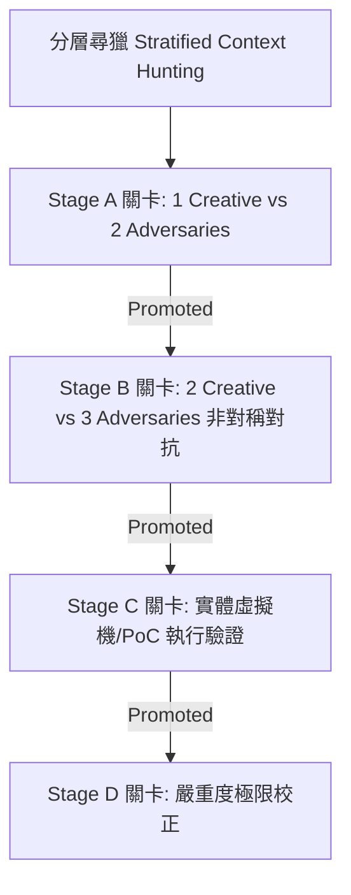

# Swarm-Driven Development (SWDD): 多代理協同開發框架 (Universal Framework)

## 1. 概述 (Overview)

**Swarm-Driven Development (SWDD)** 是一個系統化的群體智慧工作流程，旨在利用多個 AI 代理（一個群體 "swarm"）來解決複雜的工程問題。它專注於 **規格優先 (specification-first)** 的開發，使用對抗式流程在進行任何代碼實作之前「硬化（Harden）」架構與設計決策。

### 雙核心認知運行時 (SOUL & Skill Synthesis)
在 Agent 的 **AGI 雙核心架構**下，**[SOUL.md](SOUL.md)** 作為 Agent 的靈魂核心（其認知運行引擎與 FSM，並在運行合約 **[RULE.md](RULE.md)** 規範下運作），而 **Swarm-Driven Development (SWDD)** 則是至高無上的 **做事方法 (做事方法論，Meta-Skill)**。SWDD 在 SOUL 的邏輯指引下，調度、編排並執行所有其他物理技能與子代理，並透過嚴格的 XML 標籤強邊界引導 Agent 經歷各個狀態機階段，以確保結構化的解析、工具調用與實體驗證。

### 核心原則 (Core Principles)
1. **規格優先開發 (Spec-First)**：在架構或修復規格書（SPEC）通過「熔爐（Crucible，對抗式審查）」前，嚴禁編寫任何業務代碼。
2. **非對稱思辯辯論 (Asymmetric Dialectic)**：指派並行且完全隔離的角色（Builder 建設者 vs. Destroyer 破壞者）以消除認知 leniency bias（寬大效應偏差）。
3. **並行群體智能 (Parallel Intelligence)**：指派並行且獨立的研調 Swarm子代理（Alpha、Beta、Gamma）進行多維度發散研究，快速探索方案空間。
4. **驗證中心主義 (Verification-Centric)**：每一個步驟與狀態轉移皆包含實體自動化校驗或多代理協同驗證。
5. **異構模型策略 (Heterogeneous Model Strategy)**：在對抗式審查與驗證關卡中，群體**必須**調用來自不同廠商/家族的模型（例如：Creator 採用 Claude 3.5 Sonnet，Critic 採用 DeepSeek R1）。利用不同架構之間的思維波動，挖掘出同家族模型容易忽略的關聯性盲點。

### 1.1 編排機制與策略 (Orchestration Mechanics & Strategy)
為確保執行的一致性與安全防禦，SWDD 在 LLM 溝通與狀態控制上執行了嚴格的約束：
* **標準化操作程序 (SOPs)**：將複雜任務序列化為明確的 Prompt 序列與角色職責。這能確保每個子代理都只有一個明確定義的任務目標以及明確的輸入/輸出，從而徹底防止連鎖幻覺。
* **對話式思維鏈 (Communicative CoT)**：嚴禁子代理進行無限制的自由對談，所有溝通必須映射到 FSM 狀態轉移上。代理必須使用結構化 Schema（如架構規格書與測試日誌）進行信息交換，以過濾語意噪音。
* **解耦狀態控制 (Decoupled State Control)**：宏觀的 FSM 狀態機流轉由 [SOUL.md](SOUL.md) 治理，而具體的物理技能與子代理調度由 SWDD 執行，防止執行進度在長 Context 窗口中消融。

---

## 2. SWDD 生命週期 (The SWDD Lifecycle)

為了與認知狀態機完美對接，SWDD 的 6 個概念階段嚴格對應到 [RULE.md](RULE.md) 中定義的 SOUL 有限狀態機 (FSM) Hooks：

| SWDD 概念階段 | SOUL FSM Hook | 核心職責 | 運作邏輯 |
| :--- | :--- | :--- | :--- |
| **Phase 1: DESTRUCT** | `[PHASE_1_DESTRUCT]` | 並行多節點發散研究 | SOP 角色分化 (Alpha/Beta/Gamma) |
| **Phase 2: GATHER** | `[PHASE_2_GATHER]` | 資訊探測與彙整防線 | 資訊過濾與去重 |
| **Phase 3/4: CRUCIBLE** | `[PHASE_3_HYPERPLAN]` | 對抗式方案審查 (Builder vs. Destroyer) | 緩和寬大效應 (Creator vs. Critic) |
| **Phase 5: SYNTHESIS** | `[PHASE_4_SYNTHESIS]` | 最終規格與 ADR 封裝 | 狀態固化與意圖鎖定 |
| **Phase 6: IMPLEMENT** | `[PHASE_DYNAMIC_COMPILE]` | 物理執行與雙代理驗證迴圈 | 規格驅動開發與獨立審查 |

### PHASE 1: DESTRUCT (並行研究 Swarm)
指派並行且完全隔離的研調 Swarm 子代理（Alpha/Beta/Gamma）進行多維度發散研究。在 SOUL 運行時下，此階段映射至 **`[PHASE_1_DESTRUCT]`**，產生結構化的 `<DESTRUCT_RESULT>` 輸出。各子代理必須在獨立的目錄與 context 中運行。

* **Alpha 子代理 (The Standard)**：研究業界最佳實踐、標準庫框架與最主流的 Canonical 解法。
* **Beta 子代理 (The Adversary)**：專職挖掘所有潛在破壞點，包含併發 race conditions、極限邊界漏洞、資源洩漏、技術債與安全威脅。
* **Gamma 子代理 (The Innovator)**：尋求跨領域技術類比與非常規的 Alternative 替代方案。

*DESTRUCT 執行指令：*
1. **嚴格隔離**：Alpha、Beta 與 Gamma 必須在獨立目錄與 context 中運行。在 Phase 1 期間嚴禁共享任何資訊，防止早期思維對齊與同質化。
2. **輸出格式**：輸出必須為純粹的技術事實、代碼符號與直接限制條件。

**Prompt 範例：**
> "分析 [任務名稱]。重點關注：[Alpha: 最佳實踐 | Beta: 破壞性邊界 | Gamma: 新穎解法]。以項目條列方式輸出純技術事實。"

### PHASE 2: GATHER (資訊探測與彙整)
彙整來自 Alpha、Beta 和 Gamma 的事實。在 SOUL 運行時下，此階段映射至 **`[PHASE_2_GATHER]`**，產生結構化的 `<GATHER_RESULT>` 輸出。
* **指派多探測 Subagent**：依據 Phase 1 拆解的方向，派發 4 個 specialized、並行檢索的子代理：
  - **拓撲探測子代理 (Topology Discovery Subagent)**：專職調用代碼圖譜工具（`codebase-memory-mcp` 或 `graphify`）進行 AST 級別語意分析，追蹤變更邊界、關鍵類別/函數定義與依賴拓撲。
  - **記憶與知識檢索子代理 (Memory & KB Retrieval Subagent)**：調用 `mempalace` 或本地 anti-patterns 記憶庫檢索相關歷史反模式，並閱覽相關知識庫項目 (Knowledge Items, KIs)。
  - **資料庫與狀態探針子代理 (DB/Schema Probe Subagent)**：專職查詢與提取系統的資料庫 tables、Redis schemas、API 契約與狀態機定義。
  - **設計文件巡檢子代理 (Design Doc Inspector Subagent)**：巡檢專案目錄下的既存設計文件、RFC、ADR 或系統規格書（如 `docs/design/`、`docs/specs/` 或 `README.md` 中的設計藍圖），提取歷史架構意圖與硬性約束。
* **動態 AST 語意追蹤**：收集上下文時，嚴禁僅使用普通文本 regex 搜尋，必須優先調用 AST 級別語意導航。
* **設計文件完整性**：確保既存的架構設計與規格說明書被視為 Source-of-truth 指引。
* **錨定上下文 (Context Anchoring)**：將上述 4 個子代理探測到的事實、代碼拓撲、資料庫 Schema、設計文件與反模式，封裝進統一的 `<ANCHORED_MEMORY_AND_CONTEXT>` 上下文區塊中，作為 Crucible 階段及後續子代理任務派發的核心依據。

### PHASE 3 & 4: THE CRUCIBLE (Builder vs. Destroyer 與 Referee)
這是對抗式辯論階段。在 SOUL 運行時下，這兩個階段在 **`[PHASE_3_HYPERPLAN]`** 下的對抗迴圈中執行，產生結構化的 `<HYPERPLAN_RESULT>` 輸出。

1. **Builder 子代理 (架構設計)**：利用收集的資訊，提出正式的架構設計規格書 (Architecture Specification)。
   * **規格書必要章節**：
     1. *數據流 (Data Flow)*：模組職責、狀態轉移與 API 契約。
     2. *邏輯與虛擬碼 (Logic/Pseudocode)*：核心演算法邏輯與異常處理策略。
     3. *假設與限制 (Assumptions & Limits)*：外部依賴與環境邊界約束。
2. **Destroyer 子代理 (熔爐對抗)**：對 Builder 的規格書實施漏洞攻擊，檢查併發死鎖、race conditions、未捕獲異常、效能瓶頸與安全漏洞。
3. **Referee 裁判與評分子代理 (共識調度員)**：
   * **對話監控**：監督 Builder 與 Destroyer 的對話日誌，監控語意重覆度以防範 Stagnation（死鎖或停滯）。
   * **Rubric 指標評分**：裁判代理根據反模式庫（Mimir/mempalace）對 Builder 規格進行 Rubric 評分：
     $$S = \sum w_i c_i$$
     其中既存反模式為重度負分懲罰。
   * **主動熔斷閘**：若評分連續 2 輪無提升或第 3 輪仍為 FAILED，裁判代理應立即啟動熔斷器，生成 Trade-off 權衡矩陣提請人類 (HITL) 裁決。

### PHASE 5: SYNTHESIS (最終藍圖與驗證)
將通過 Crucible 認證的方案共識封裝為設計文檔與實作藍圖。在 SOUL 運行時下，此階段映射至 **`[PHASE_4_SYNTHESIS]`**，產生結構化的 `<SYSTEM_SPECIFICATION>` 輸出。
* 撰寫 **ADR (架構決策記錄，Architecture Decision Record)**，說明決策背景與採用該方案的原因（並將 Crucible 的辯論日誌納入考量）。
* **深度融合 Spec-Driven 與 Test-Driven 設計契約**：
  - **規格驅動合約 (Spec-Driven Contract)**：定義嚴格的 API 與介面契約。必須條列出目標檔案、被修改函數的簽章 (Signatures)、輸入/輸出參數、異常拋出類型與潛在副作用，並與 Phase 2 收集的既存設計文件與 DB schemas 完美對齊，防止架構漂移。
  - **測試驅動合約 (Test-Driven Contract)**：強制將模糊的驗收條件轉換為具體測試案例。要求預先規劃 TDD 測試腳本的路徑，列出預期能重現失敗 (Red state) 的正向、反向與邊界斷言 (Assertions) 案例，以及在 Terminal 中執行該測試的精確命令。
  - **目標驅動驗收計畫**：使用「步驟 → verify: 驗證方法」的目標驅動格式規劃實作路徑。
* **藍圖合約驗證 (Blueprint Contract Verifier Subagent)**：在封裝輸出前，指派專屬的驗證子代理，將生成之 `SYSTEM_SPECIFICATION` 合約與 Phase 2 蒐集到的既存設計規格、資料庫 Schema 及防禦邊界進行比對審計，確認無誤後才允許與 master 分支合併。

### PHASE 6: IMPLEMENT & REVIEW (多代理協同實作與物理執行)
在 SOUL 運行時下，此階段映射至 **`[PHASE_DYNAMIC_COMPILE]`** 階段，這是 Swarm Driven、Test Driven 與 Life-Harness 的最終整合熔爐。
* **思維引導**：按以下階段有序引導 subagents：

**Stage 1. 執行前閘道 (Action Realization Gateway)** — 重試上限 2 次，超限觸發 HITL
在派發任務前，主控程序必須對任務包進行強制性預檢，融合 Spec、Test 與 Memory 驅動要求：
- **Spec-Driven 檢查**：確認任務邊界與架構決策 (ADR) 清晰，不觸發 §4 防火牆攔截（含 TC-08/TC-09 消毒）。
- **Test-Driven 檢查**：確認 TDD 驗收條件已定義，且 Red-state 失敗腳本已就緒。
- **Memory & Global Context 檢查 (Crucial)**：確認任務包中是否包含 `<ANCHORED_MEMORY_AND_CONTEXT>` 標籤，內含 Phase 2 收集之 codebase 全貌、歷史記憶（反模式）與資料庫/狀態定義。若缺少或為空，必須阻斷 (Block) 派遣並退回重新編排，防止 subagent 盲目執行。
- **Residual Reasoning 檢查**：若任務涉及數值計算（金額、索引、公式推導），強制要求 subagent 在實作中提供中間步驟的可驗證斷言 (assertions)，以便在 Stage 3 中自動校驗。
- **攔截機制 (Block)**：若任一項未通過，拒絕派遣，並回退至 SYNTHESIS。**回退至 SYNTHESIS 的上限為 2 次**；超過 2 次仍被 Block 則強制觸發 Adaptive HITL 物理確認，嚴禁無限迴圈。

**Stage 2. 實體沙箱隔離與 DAG 派遣 (Swarm-Driven Execution)**
- **DAG 任務編排**：建構依賴項 DAG（如 `Schema` -> `API` -> `UI`），異步發派。
- **實體沙箱隔離**：強制在臨時隔離目錄、獨立 Worktree 或一次性容器中運行實作與測試。
- **TDD 職責分離雙代理執行**：
  - **測試編寫子代理 (Test Writer Subagent)**：專職根據 Phase 5 的 TDD 合約，在沙箱中撰寫測試腳本（含正反向、邊界斷言），運行並確認其物理處於失敗狀態（Red State）。
  - **代碼開發子代理 (Developer Subagent)**：接收並載入測試編寫子代理產出的 Red State 測試腳本與 Spec 規格合約，在嚴禁修改測試腳本的前提下，編寫業務程式碼以通過所有測試（Green State）。
- **審查子代理審查 (Reviewer Subagent)**：派發獨立審查子代理審查測試的覆蓋率、代碼的簡潔度（§2.3）與潛在安全弱點，確認無誤後才允許與 master 分支合併。

**Stage 3. 執行後守門 (Trajectory Regulation Gateway)** — 重試上限 3 次，超限觸發 HITL
subagent 回傳後，必須通過物理執行驗證：
- **Test-Driven 驗證**：執行測試。若處於 Red-state，自動依據 §8.2 系統除錯規則開啟修復迴圈 (**重試上限 3 次**)。拒絕用紙面 null check 掩蓋漏洞。**超過 3 次仍為 Red-state，則強制觸發 Adaptive HITL 物理確認**，嚴禁無限迴圈。
- **Residual Reasoning 驗證**：自動執行數值斷言腳本，校驗中間計算步驟是否正確（如 off-by-one、幣值精度、邊界值）。
- **合約攔截 (XML Parsing)**：驗證 XML 標籤閉合且無雜質。違規時打回要求 1 輪內自我修正。
- **退化偵測 (Stagnation/Repetition)**：套用 §7.0 Trajectory 規則，若偵測到 Swarm 在盲目猜測或循環，立刻觸發 Role Gating 或 Rollback。
通過後生成 `<TASK_SUMMARY_REPORT>`。

---

## 3. Refute-or-Promote: 對抗式分階段漏洞挖掘協議

針對代碼安全審計、回歸分析和深度漏洞挖掘任務，Swarm 會繞過常規的合作結構（這類結構往往因「迎合偏見 Agreeableness Bias」導致極高的誤報率），強制啟用 **Refute-or-Promote** 機制。

### 3.1 分層尋獵 (Stratified Context Hunting, SCH)
在進入審查關卡之前，漏洞候選包由並行的尋獵子代理在三個不重疊的維度上生成：
1. **來源分層 (Source Stratification)**：Hunters 被分配以非重疊的輸入來源（例如：CVE 數據庫、歷史提交、規格手冊或漏洞 Checklists）。
2. **範圍分層 (Scope Stratification)**：Hunters 被限制在非重疊的目錄或架構組件中（例如：內存管理、解析器或網絡處理器）。
3. **波動分層 (Wave Stratification)**：分析以波浪式迭代進行。後續波動會被注入前一輪晉升與駁斥的明確邏輯（Rationales）作為 Few-shot，以不斷收窄和優化搜尋路徑。

### 3.2 四個驗證關卡 (The Four Stage Gates)
候選漏洞必須在四個對抗式驗證關卡中存活，才允許被呈報：
* **Stage A Gate (初始篩選)**：派遣 1 個 Creative 代理編寫漏洞可達性論證，並由 2 個獨立的 Adversarial 代理嘗試駁斥它。Adversaries 僅拿到漏洞描述（不包含推理過程）以防止確認偏見。任一 Adversary 駁斥成功，即予以駁回。
* **Stage B Gate (非對稱共識)**：派遣 2 個 Creative 與 3 個 Adversarial 代理（包含高級模型）進行對抗。代理在非對稱上下文下運作（部分讀取完整摘要，部分冷啟動審查）以確保漏洞可達性的獨立審計，防止錨定效應。
* **Stage C Gate (經驗實體重現)**：為徹底消除模型幻覺，系統會單獨開闢一個隔離的虛擬沙箱 (Sandbox)，編譯目標專案並執行實體 Proof-of-Concept (PoC) 利用腳本。無法在沙箱中重現或執行失敗的漏洞一律直接阻斷。
* **Stage D Gate (嚴重度校正)**：已確認的缺陷將進行自動化嚴重度判定。Adversaries 會嘗試根據沙箱中的真實物理限制調低 CVSS 指標，最終呈報給人類。

---

## 4. 上下文優化 (Arachne Context Engine)

為防止 LLM 出現 "lost-in-the-middle"（丟失中段資訊）效應並節省 token，代碼檢索必須經過 **Arachne 上下文優化器** ($N_2$-arachne) 處理：
* **超高壓縮率**：arachne 使用 C++ SIMD 擴充指令集，在運行時分析程式碼庫的依賴拓撲，將上下文需求壓縮高達 **98.5%**。
* **排序規則**：arachne 依照 $f(x) \propto 1/x$ 的分佈排列檢索到的 context 區塊。將高相關度目標放在 Prompt 窗口的最前端與最末端（即注意力焦點），此處 LLM 的 Recall 召回率在數學上表現最為強勁。

---

## 5. 何時啟用 SWDD

在 SOUL 認知運行時下，Swarm-Driven Development (SWDD) 是所有程式開發、代碼修改、依賴變更與配置調整的**強硬且預設的路徑**。單代理直接執行僅限於非功能性的純文檔更新。

*實作註記：一旦任務在 SOUL 的 **`[INTENT_GATE]`** Hook 中被解析，所有工程與 codebase 任務必須顯式將 **`USE_SWARM_WORKFLOW: True`** 寫入輸出。*

| 專案類型 | 啟用 SWDD? | 運作邏輯 |
| :--- | :---: | :--- |
| **純文檔編輯** | 否 (選用) | Markdown 拼字修正或註解排版調整，不改變代碼邏輯。 |
| **簡單 Bug 修復 (即使 1 行)** | **是 (強制)** | 防範回歸 (Regression)，驗證副作用並執行代碼契約校驗。 |
| **複雜 Bug 修復** | **是 (強制)** | 追查根本原因，確保 Crucible 漏洞對抗攔截。 |
| **新增模組/功能** | **是 (強制)** | 防止架構漂移，提供嚴格的 TDD 與介面合約。 |
| **重構遺留代碼** | **是 (強制)** | 描繪隱藏依賴，建立 AST 變更邊界。 |
| **安全關鍵路徑** | **是 (強制)** | 必須通過 Refute-or-Promote 審查關卡與沙箱重現驗證。 |
| **探索性研究** | **是 (強制)** | 調度並行 Swarm 子代理 (Alpha/Beta/Gamma) 多維度發散。 |

---

## 6. 工具與自動化 (Tooling & Automation)

### Clawteam 整合 (複雜 Swarms)
針對超高複雜度任務，可調用 `clawteam` 管理持久化代理 Swarm：
* `clawteam launch research-paper`：用於 Phase 1 深度研究。
* `clawteam launch code-review`：用於 Phase 4/6 對抗式代碼審核。

### 代理 CI/CD 背景整合 (Agentic CI/CD)
* Refute-or-Promote 對抗式框架可部署為背景監聽器（例如集成於 Git Hooks 或 GitHub Actions 中）。
* 當開發者發起 Pull Request 時，"紅軍代理 (Red Team Agent)" 將自動喚醒執行安全掃描與邏輯交叉審訊，使 SWDD 從開發方法論升級為「持續運行的智能免疫系統」。

### 規格優先範本 (SPEC-Driven Templates)
專案必須在 `docs/specs/` 中維護規格文件。一份規格只有在包含以下內容時才算「完整」：
* **問題定義 (Problem Statement)**
* **介面合約 (Interface Contract)** (包含輸入、輸出與副作用定義)
* **驗收標準 (Acceptance Criteria)** (建議採用 Gherkin/BDD 格式)
* **風險評估 (Risk Assessment)**

---

## 7. 通用最佳實踐 (Universal Best Practices)

1. **(§8.1) Source-First Analysis**：不要只信任文檔。在 Phase 1 開始前，必須閱讀相關原始代碼（「唯一的真理」）。（與 §2.1 Read Before Write 互為補充：§2.1 聚焦於「寫代碼前先讀」，§8.1 聚焦於「分析問題前先讀原始碼而非文檔」）
2. **(§8.2) 系統性除錯 (Scientific Debugging)**：在做任何變更前必須能穩定重現問題。每次僅變更一個變數。**嚴禁使用 Null Check 等紙面防禦來掩蓋非預期的 Null 漏洞**（亦見 §7.1 樂觀路徑反模式），必須追查源頭，否則 Bug 只會轉移到更難被察覺的地方。
3. **(§8.3) 透明且精確的溝通 (Communication)**：解釋你所做的事情與背後原因，而非僅丟出程式碼。對不確定性要保持精確（例如說「我不確定此庫是否支援串流」，而非邏輯模糊的「我覺得應該可以工作」）。
4. **(§8.4) Arachne 上下文優化**：為防 LLM 的 "lost-in-the-middle" 效應，高相關度的 Context 區塊必須排在 Prompt 窗口的最前端與最末端。
5. **(§8.5) 共識限制**：Builder 與 Destroyer 在 Crucible 階段對抗最多 3 輪，無法達成一致必須立刻熔斷提請 HITL。
6. **(§8.6) Git 乾淨提交**：實作 subagent 提交 Commit 時，必須對照 Synthesis 中規劃的邏輯分塊。
